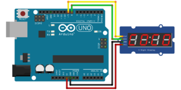
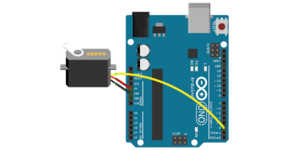

# Arduino code collections

## 7-Segment Display

## 7 Segment LED display current time (ESP8266)

## Addressable LED

## HC-SR04 with buzzer

## DHT22 sensor data to SD card

## Ultrasonic sensor

## Infrared Controller for Home Assistant

## NeoPixel LED Circle

## NodeMCU GPIO Led

## Photoresistor

## Arduino controlled servo

## Arduino reading BME-280 sensor
