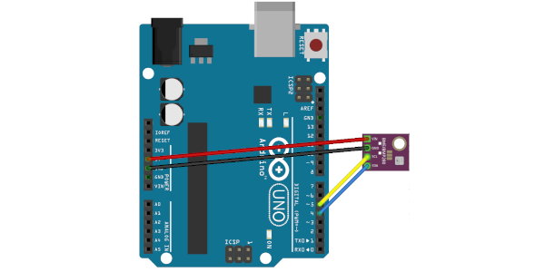

# Arduino reading BME-280 sensor

## I2C communication protocol

BME280 | UNO |
:---: | :---: |
VIN | 5V |
GND | GND |
SCL | GPIO 5 |
SDA | GPIO 4 |

## SPI communication protocol

BME280 | UNO |
:---: | :---: |
VIN | 5V |
GND | GND |
SCL | GPIO 13 |
SDA (MISO) | GPIO 12 |
SDI (MOSI) | GPIO 11 |
SDA (CS) | GPIO 10 |